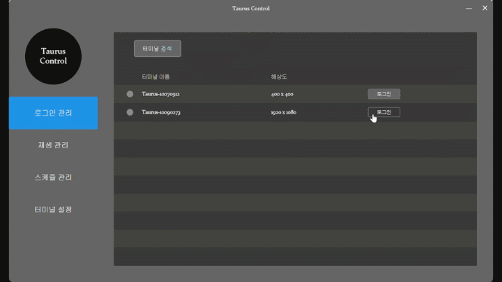

# Taurus Control

Novastar에서 제공하는 Viplex Express를 더욱 쉽고 편리하게 사용할 수 있도록 개선한 Windows 데스크톱 애플리케이션입니다.
직관적인 UI와 다양한 기능으로 터미널 제어를 간편하게 수행할 수 있습니다.

## Features

### 🔍 터미널 검색 및 관리
- 동일 네트워크 내 Taurus 터미널 자동 검색
- 저장된 비밀번호로 자동 로그인
- 로그인 상태 실시간 표시 (녹색/노란색/회색)



### 🎬 미디어 재생 관리
- 미디어 파일 추가/삭제/순서 변경
- 지원 포맷: mp4, avi, jpg, png, gif
- **한글 파일명 완벽 지원**
- 키보드 단축키로 빠른 작업


### ⏰ 전원 스케줄 설정
- 요일/시간별 자동 ON/OFF 설정
- 여러 시간대 등록 가능
- 수동 모드 / 자동 모드 전환
- 한글로 표시되는 직관적인 스케줄


### ⚙️ 터미널 설정
- PC 시간과 자동 동기화
- 재부팅 스케줄 설정
- LED 밝기 조절 (0-100%)


## Installation

### Windows 인스톨러 (.msi)

1. [Releases](https://github.com/tjdakf/TaurusControl/releases) 페이지에서 최신 버전 다운로드
2. `TaurusControl-1.0.0.msi` 파일 실행
3. 설치 마법사 지시에 따라 설치
4. 시작 메뉴 또는 바탕화면 아이콘으로 실행

## System Requirements

- **운영체제**: Windows 7 / 10 / 11 (64bit)
- **네트워크**: Taurus 터미널과 동일 LAN 연결 필수
- **디스크 공간**: 250MB 이상 필요

## Quick Start

1. **터미널 검색**: 프로그램 실행 → 로그인 관리 → 터미널 검색
2. **로그인**: 터미널 선택 → 비밀번호 입력 → 로그인
3. **미디어 업로드**: 재생관리 탭 → 파일 선택 → 전송

자세한 사용 방법은 [사용자 매뉴얼 PDF](https://github.com/tjdakf/TaurusControl/releases)를 참고하세요.

## Troubleshooting

### 터미널이 검색되지 않아요
- 터미널과 PC가 같은 네트워크에 연결되어 있는지 확인
- 방화벽 설정 확인
- Viplex Express가 사용중인지 확인 (동시에 사용할 수 없습니다.)

### 로그인이 안돼요
- 비밀번호가 정확한지 확인
- 비밀번호 오류가 3회 이상 넘어갈 시 Taurus 자체적으로 1분 간 모든 로그인 시도를 막습니다. 일정 시간이 지난 후 다시 시도하세요.

### 프로그램이 실행되지 않아요
- Windows 버전 확인
- 관리자 권한으로 실행 시도
- 프로그램 재설치

---

## Uninstallation

### 프로그램 제거

1. **Windows 설정에서 제거**
   - 설정 → 설치된 앱 → TaurusControl 선택 → 제거

2. **사용자 데이터 삭제 (선택사항)**

   프로그램 제거 후에도 아래 폴더에 데이터가 남아있습니다:
   ```
   C:\Users\(사용자명)\TaurusControl
   ```

   **포함 내용**:
   - 실행 로그 파일
   - 데이터베이스 (터미널 로그인 정보, 비밀번호 등)
   - 프로그램 설정

   **완전 삭제 방법**:
   - 위 폴더를 수동으로 삭제하세요.

   ⚠️ **주의**: 프로그램을 재설치할 예정이라면 이 폴더를 유지하세요. 저장된 설정과 로그인 정보가 보존됩니다.

---

## For Developers

개발 관련 문서는 [DEVELOPMENT.md](DEVELOPMENT.md)를 참고하세요.

## Changelog

전체 변경 이력은 [CHANGELOG.md](CHANGELOG.md)를 참고하세요.

## License

This project is licensed under the MIT License - see the [LICENSE](LICENSE) file for details.
