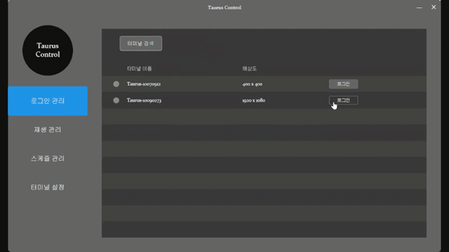

# TaurusControl

NovaStar Taurus 장비의 검색·로그인, 미디어 전송, 전원 스케줄과 화면 설정을 한 화면에서 다루기 위해 만든 JavaFX 기반 Windows 애플리케이션입니다. Java에서 T-SDK의 네이티브 API를 호출할 수 있도록 JNA로 연결하고, 비동기 콜백 결과를 애플리케이션 상태와 UI에 반영했습니다.

| 항목 | 내용 |
| --- | --- |
| 개발 상태 | Java·Spring 기본기 학습을 우선하며 추가 개발 일시 중단 |
| 검증 범위 | 실제 Taurus 장비에서 아래 핵심 기능 테스트 |
| 운영 범위 | 고객 현장 배포 및 장기 운영 이력 없음 |
| 검증한 SDK | NovaStar T-SDK `3.6.3.0101` / Windows x64 |

## 해결하려던 문제

Taurus 장비를 운영할 때 반복하는 터미널 탐색·로그인, 미디어 구성·전송, 전원 및 화면 설정을 하나의 UI에서 처리하도록 작업 범위를 정했습니다. SDK가 제공하는 콜백 기반 API와 JSON 요청 형식을 분석하고, 화면·컨트롤러·서비스/도메인·SDK 연동 계층으로 역할을 나누어 구현했습니다.

## 구현 및 장비 검증 범위

- 동일 LAN의 Taurus 터미널 검색, 로그인 및 상태 표시
- 이미지·영상·GIF 재생 목록 구성, 순서 변경 및 장비 전송
- 한글 파일명이 포함된 미디어 전송
- 화면 ON/OFF 스케줄과 수동 모드 설정
- 시간 동기화, 재부팅 스케줄 및 밝기 설정

다른 기능 데모 보기

### 터미널 검색과 로그인

### 전원 스케줄

### 터미널 설정

## 문제 해결 사례: 한글 파일명 전송

SDK 가이드에 따라 미디어 전송을 구현한 뒤 한글 파일명에서 콜백 오류가 발생하는 상황을 확인했습니다. 원본 파일명은 화면 표시와 프로그램 정보에 유지하되, 전송 시에는 SDK로 계산한 MD5를 이름으로 사용하는 임시 파일을 만들도록 변경했습니다. 전송 완료 후 임시 파일을 삭제하고, 한글 파일이 포함된 재생 목록이 실제 장비에서 동작하는지 확인했습니다.

## 역할과 AI 활용

요구사항을 선정하고 T-SDK의 API와 비동기 콜백 흐름을 분석했습니다. 구현과 리팩터링에는 생성형 AI를 적극 활용했으며, 생성된 결과를 그대로 완료로 판단하지 않고 SDK 문서, 실행 결과와 실제 Taurus 장비 동작을 기준으로 확인했습니다. 핵심 기능 검증 후에는 Java와 Spring의 기본기 학습을 우선하기 위해 추가 개발을 멈췄습니다.

## 기술 구성

- Java 21, JavaFX 21
- Gradle, JUnit 5, AssertJ
- JNA 기반 NovaStar T-SDK 연동
- JSON 템플릿 기반 SDK 요청 구성

자세한 구조와 개발 명령은 [개발 가이드](DEVELOPMENT.md), SDK 준비 방법은 [SDK 설정 가이드](docs/SDK_SETUP.md)를 참고해 주세요.

## 실행 전 확인

- 소스 빌드와 테스트에는 JDK 21이 필요합니다.
- 실제 애플리케이션 실행과 장비 연동에는 Windows x64, 검증한 T-SDK, 동일 LAN의 Taurus 장비가 필요합니다.
- 특정 Windows 버전별 호환성 범위와 최신 T-SDK 호환성은 별도로 검증하지 않았습니다.

## License

직접 작성한 프로젝트 소스는 [MIT License](LICENSE)를 따릅니다. NovaStar T-SDK와 SDK에 포함된 제3자 파일은 이 라이선스의 적용 대상이 아닙니다. 자세한 구분은 [Third-Party Notices](THIRD_PARTY_NOTICES.md)를 확인해 주세요.
